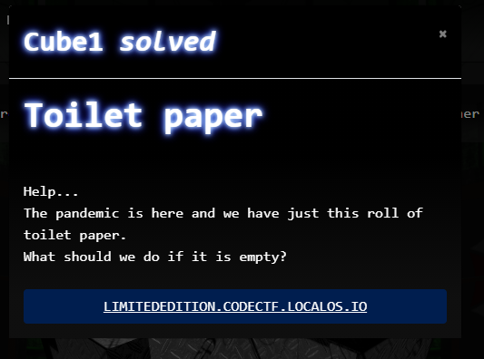
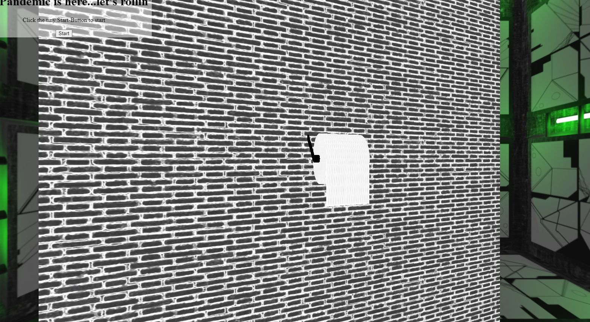
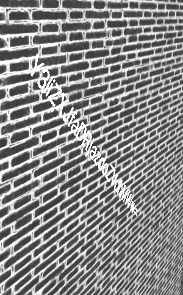

# CTF2020 - Cube Apocalypse Quali: Toilet paper

  
  


## Description


## Attached files
- 

## Flag
```
cyber_h4ck7heWa1l
```

## Detailed solution
The task was to unroll a virtual toilet paper roll in a WebGL application as fast as possible by clicking on it after clicking on the start button.





I used an auto clicker application for that. 

After the toilet paper roll was empty, you could navigate through the scene with the mouse.

The back of the wall showed the flag base64 encoded:

