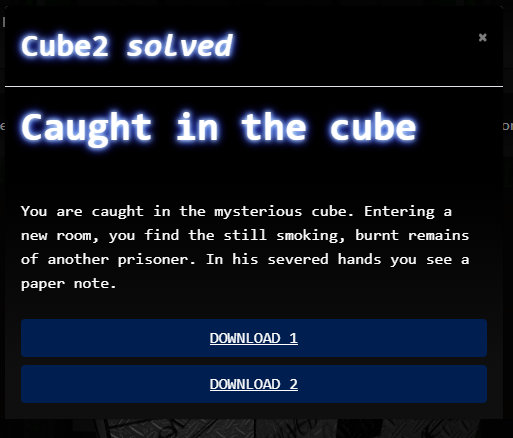
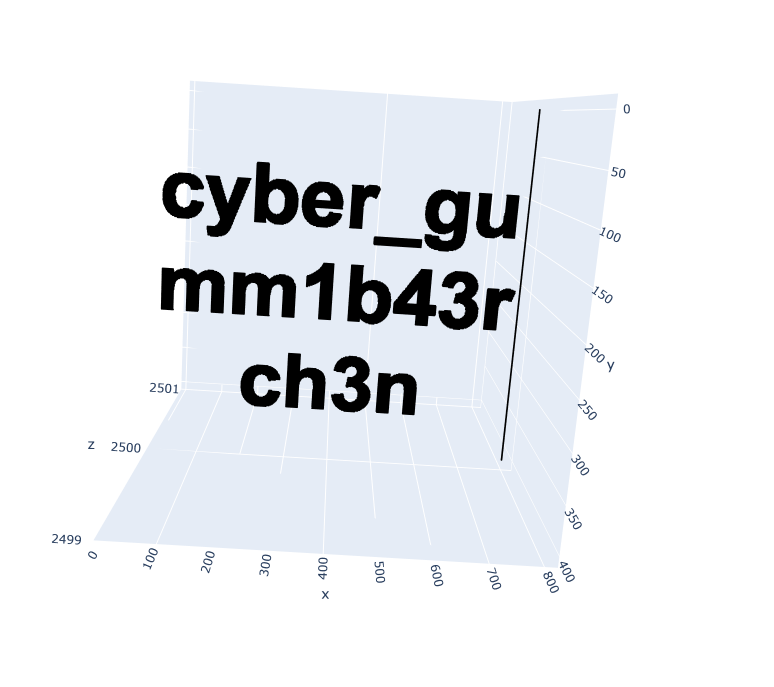

# CTF2020 - Cube Apocalypse Quali: Caught in the cube

  
  


## Description


## Attached files
- burntnote.jpg
- cubes.txt

## Flag
```
cyber_gumm1b43rch3n
```

## Detailed solution
By looking at the burntnote.jpg and the hints hidden on it, it was clear, that the positions of the rooms given in cubes.txt have to be moved by calculating their positions. Their positions are calculated by adding or substracting a certain value to or from them. These certain values were always shifted by one position to the right. The values themselves were calculated by prime factorization of the room number.

Therefore we iterated over the lines in the cubes.txt file, split the room number and the positions apart, prime factorized the room number, did the calculations and plotted the result with plotly.


```python
def prime_factorization(n):

    prime_factors = {}

    i = 2
    while i**2 <= n:
        if n % i:
            i += 1
        else:
            n /= i
            try:
                prime_factors[i] += 1
            except KeyError:
                prime_factors[i] = 1

    if n > 1:
        try:
            prime_factors[n] += 1
        except KeyError:
            prime_factors[n] = 1
    return prime_factors

cubeFile = open("cubes.txt", "r")

x = []
y = []
z = []

shift = 4

for line in cubeFile:
    roomNumber = int(line.split(',')[0])
    primes = deque(prime_factorization(roomNumber).keys())
    primes.rotate(shift) # This line changed everything ;D
    first = int(line.split(',')[1])
    second = int(line.split(',')[2])
    third = int(line.split(',')[3])
    for i in range(shift):
        if (i % 2 == 0):
            # add
            first += int(primes[0])
            second += int(primes[1])
            third += int(primes[2])
        else:
            # substract
            first -= int(primes[0])
            second -= int(primes[1])
            third -= int(primes[2])

        primes.rotate(1)
    x.append(first)
    y.append(second)
    z.append(third)

trace = go.Scatter3d(
    x=x, y=y, z=z, mode='markers', marker=dict(
        size=1,
        color='black',
    )
)
layout = go.Layout(title='3D Scatter plot Step: ' + str(shift))
fig = go.Figure(data=[trace], layout=layout)
plotly.offline.iplot(fig)
```


That lead to:

`