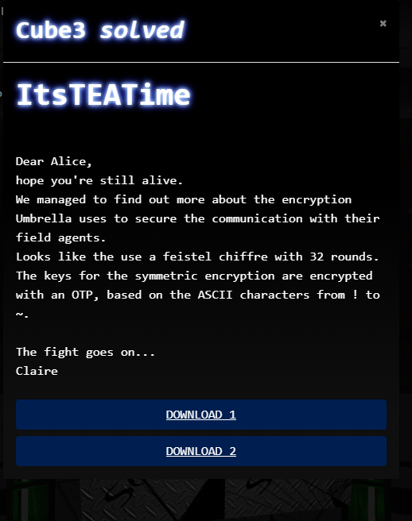

# CTF2020 - Cube Apocalypse Quali: ItsTEATime

  
  


## Description


## Attached files
- cipher.txt
- Oracle.exe

## Flag
```
cyber_t1ny4nd1ns3cur33ncrypt10n
```

## Detailed solution
I solved this challenge an hour before the qualification ended. It was pretty close.

After inspecting the application with Ghidra and some debugging with x32dbg (included in [x64dbg](https://x64dbg.com/#start)) I could figure out, that the generated One Time Pads changed on the selection of the user.

The generated OTPs were then used to generate a transmission key.

The key, that was entered by the user was then used to encrypt some plaintext of the user with TEA ([Tiny Encryption Algorithm](https://de.wikipedia.org/wiki/Tiny_Encryption_Algorithm)).

Notice, that the challenge description states, that a narrower alphabet is used for the OTP, being the character '!' on position zero of the alphabet.


The file 'cipher.txt' contained what looked like a transmission key and some encoded data.

Based on these information, I got all possible OTPs from the application by passing 1024*'!' as a key, I ended up with 45 unique OTPs.

Then I wrote a script, that iterated over all characters of every OTP to calculate a string that would result in the given transmission key and tried to decrypt the encoded data with the calculated key.

Here is the full script:

```python
import string
import struct
from binascii import unhexlify

cryptedKey = 'tcW6K}8)tnWxr0\'O'

def decrypt(v, k):
    v0,v1 = struct.unpack("!2L",v)
    x = 0xC6EF3720
    delta = 0x9E3779B9
    k = struct.unpack("!4L",k)
    for i in range(32):
        v1 -= ((v0 << 4) + k[2]) ^ (v0 + x) ^ ((v0 >> 5) + k[3])
        v1 = v1 & 0xFFFFFFFF
        v0 -= ((v1 << 4) + k[0]) ^ (v1 + x) ^ ((v1 >> 5) + k[1])
        v0 = v0 & 0xFFFFFFFF
        x -= delta
        x = x & 0xFFFFFFFF
    return struct.pack("!2L",v0,v1)

encodedText = [
    unhexlify('2398b83d89439861'),
    unhexlify('b0d37395d996f061'),
    unhexlify('91ecc1776650648c'),
    unhexlify('2a230c41828a2f27'),
    unhexlify('cbb1b3570fe5b413'),
    unhexlify('9f301a4c35b01e8b'),
    unhexlify('0f5d9d083c2d92e8'),
    unhexlify('73d3267477058ef4'),
    unhexlify('4f857bdb5ae0c3d2'),
    unhexlify('f6aee2f6f48914d4'),
    unhexlify('8d1653bf24601f87'),
    unhexlify('8fa9c3538fb43ad7'),
    unhexlify('8f3fcfbdb858ad32'),
    unhexlify('efac5ed5fa7d8130'),
    unhexlify('a130a66f88f4d41b'),
    unhexlify('06f4d66e1931b2d5'),
    unhexlify('8f59210bf47bdbd5'),
    unhexlify('9ce37527e950e9fc'),
    unhexlify('c3a0d7ce3294cc34'),
    unhexlify('f6aee2f6f48914d4'),
    unhexlify('b114004d7f741725'),
    unhexlify('b724d22e8224796d'),
    unhexlify('3bee53dbe104103c'),
    unhexlify('f399d4ca6db6a4ba'),
    unhexlify('f225398008d2122c'),
    unhexlify('c0da1b3f65f904ae'),
    unhexlify('2b4ea98389f28e86'),
    unhexlify('d6ae1d8061238648'),
    unhexlify('42548820f4deedb1'),
    unhexlify('49b4bf74d999ee37')
    ]


f = open("OTP.txt", "r")
#iterate over all generated OTPs
for line in f:
    # iterate over all characters of an OTP
    for i in range(1024):

        # Calculate string that will lead to transmission key
        part = []
        for j in range(16):
            # clamp alphabet from '!' to '~'
            if (ord(cryptedKey[j]) >= ord(line[i + j])):
                char = chr(ord(cryptedKey[j]) - ord(line[i + j])+ 33)
                part.append(char)
            else:
                char = chr(94 - (ord(line[i + j]) - ord(cryptedKey[j]))+33)
                part.append(char)
        password = ''.join(part)

        # Iterate over cipher to unTEA it
        result = []
        for foo in encodedText:
            untea = decrypt(foo, password.encode())
            result.append(untea)
        results = b''.join(result)
        # Search for the flag 'cyber_' by looking for byte differences
        # between the letters, as the alphabet might be shifted here, too
        for bar in range(len(results) - 3):
            if (results[bar+1] - results[bar] == 22 and results[bar+1] - results[bar+2] == 23 and results[bar+3] - results[bar+2] == 3):
                print(results)
      
```

