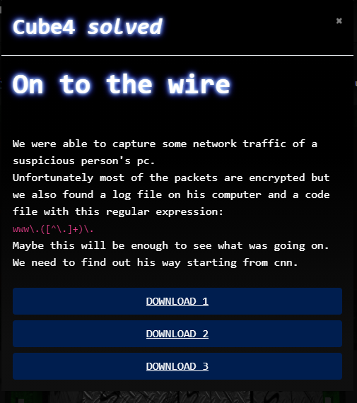
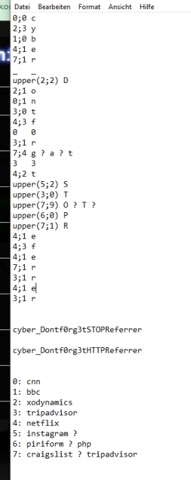

# CTF2020 - Cube Apocalypse Quali: On to the wire

  
  


## Description


## Attached files
- capture.pcap
- code.txt
- log.log.txt

## Flag
```
cyber_Dontf0rg3tHTTPReferrer
```

## Detailed solution
I did not solve this challenge as it was supposed to be, I think.

First thing that came to my mind after seeing the regex in the challenge description was, that I could filter for all domain names in the pcap file.

This gave me a huge list of domain names, beginning with 'cnn' as the first entry.

After that I had a look at the code.txt file, which has a pretty interesting format:

```
0;0
2;3
1;0
4;1
7;1
_
upper(2;2)
2;1
0;1
3;0
4;3
0
3;1
7;4
3
4;2
upper(5;2)
upper(3;0)
upper(7;9)
upper(6;0)
upper(7;1)
4;1
4;3
4;1
7;1
3;1
4;1
3;1

```

First five lines of the file clearly indicate, that you need to put 'cyber_' in there.

What a coincidence of 'cnn' being the first entry of my url list and its first character being a 'c'...

With this information I made my way through all the lines finding urls that could fit this format, leading to my conclusion:



Flag must be 'cyber_Dontf0rg3tSTOPReferrer' or 'cyber_Dontf0rg3tHTTPReferrer'. Second one made more sense, and it was the flag indeed.