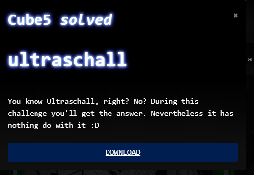

# CTF2020 - Cube Apocalypse Quali: ultraschall

  
  


## Description


## Attached files
- ultraschall

## Flag
```
cyber_Ih4t3SMTr3s
```

## Detailed solution
For this challenge I used angr to find all the deadends after inspecting the application with Ghidra.

I needed to add some constraints to make the processing go faster and knew, that the deadend I wanted to reach is some string with 'munich' in it:

```python
import angr
import claripy

proj = angr.Project("ultraschall", load_options={"auto_load_libs": False}) 

argv1 = claripy.BVS("argv1", 0x11 * 8)

state = proj.factory.full_init_state(
        args=['./ultraschall', argv1],
        add_options=angr.options.unicorn,
)


for byte in argv1.chop(8):
    state.add_constraints(byte != '\x00') # null
    state.add_constraints(byte >= ' ') # '\x20'
    state.add_constraints(byte <= '~') # '\x7e'

# Add some constraints or this will take forever...        
state.add_constraints(argv1.chop(8)[0] == 'c')
state.add_constraints(argv1.chop(8)[1] == 'y')
state.add_constraints(argv1.chop(8)[2] == 'b')
state.add_constraints(argv1.chop(8)[3] == 'e')
state.add_constraints(argv1.chop(8)[4] == 'r')
state.add_constraints(argv1.chop(8)[5] == '_')

simgr = proj.factory.simulation_manager(state)

simgr.run()

for pp in simgr.deadended:
    if pp.posix.dumps(1).find("Munich".encode()) != -1:
        print(pp.solver.eval(argv1, cast_to=bytes))

```

