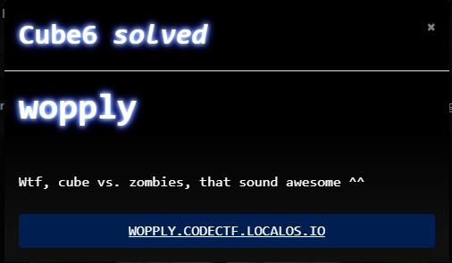
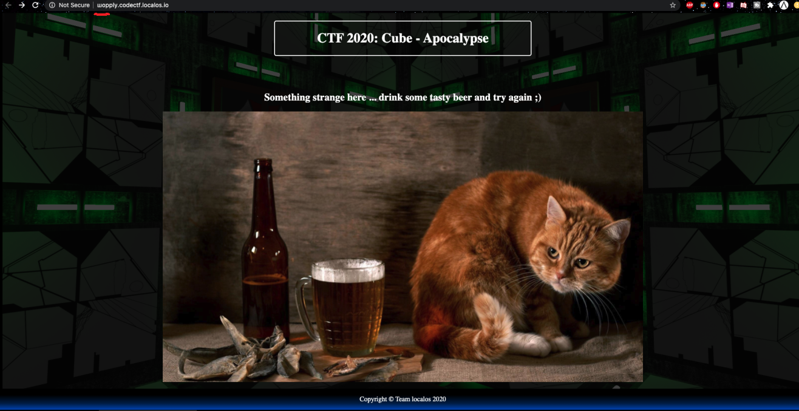
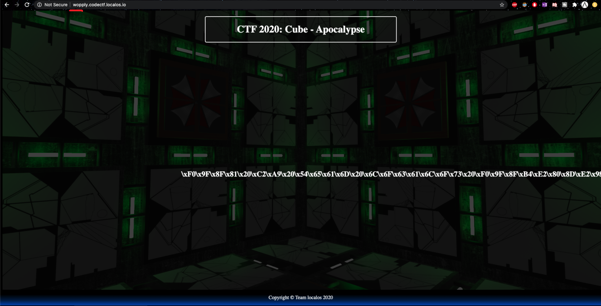

# CTF2020 - Cube Apocalypse Quali: wopply

  
  


## Description


## Attached files
- 

## Flag
```
cyber_h0m0gr4phsAreR34l
```

## Detailed solution
The link in the description lead to a page that was showing a cute picture of a cat. Nothing of interest elsewhere, but the url!




The url contained some [Punycode](https://en.wikipedia.org/wiki/Punycode ) that made it look like 'wopply' even if it wasn't.

Correcting that by replacing the punycode with an actual 'w' lead to a page with the flag hex encoded.



